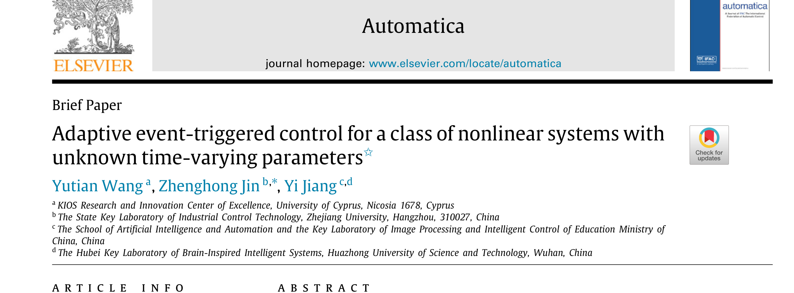
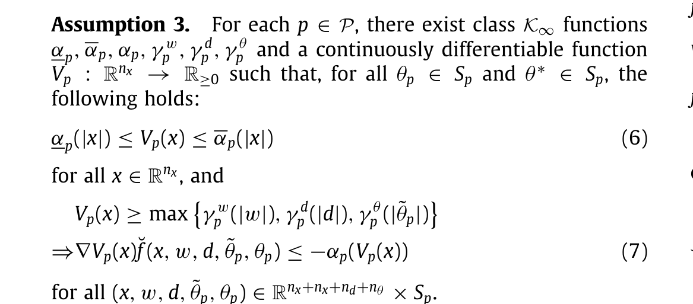
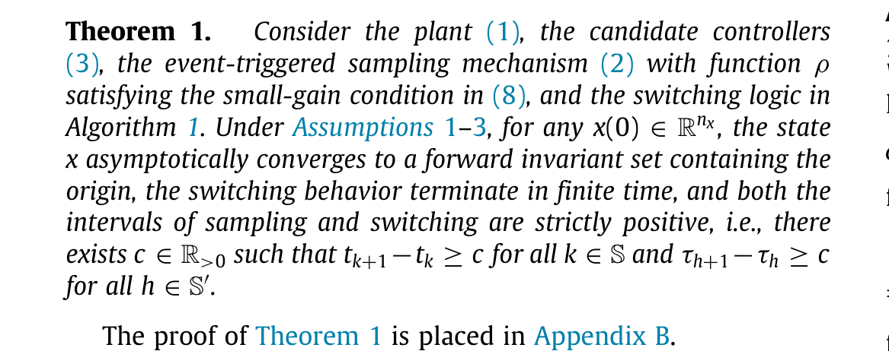
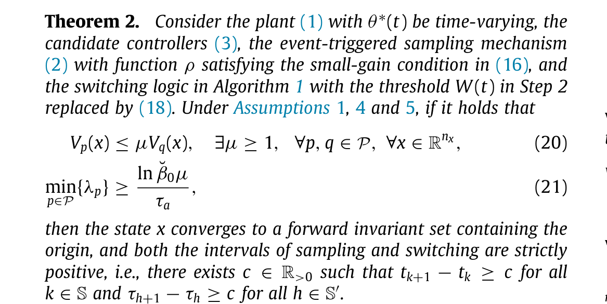
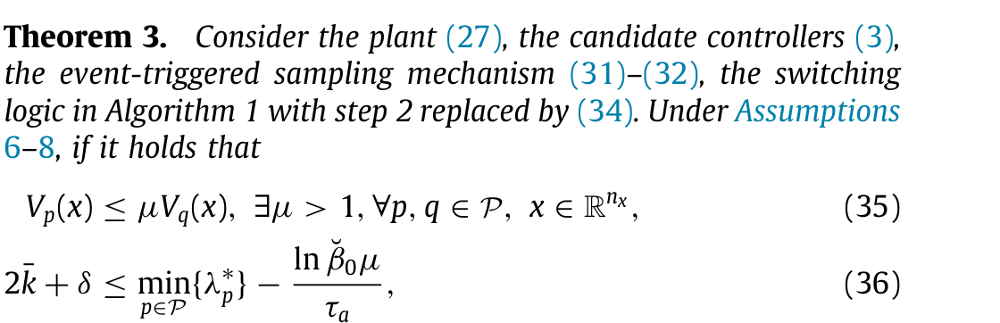
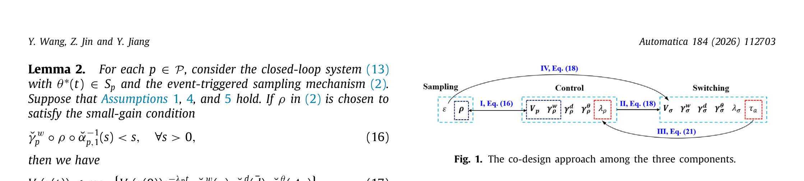
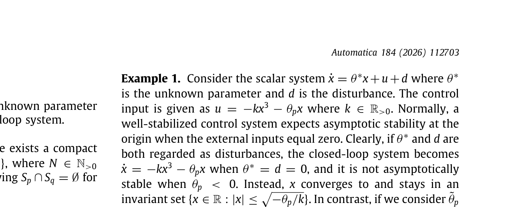

# 面向一类具有未知时变参数的非线性系统的自适应事件触发控制

- 作者：Yutian Wang, Zhenghong Jin, Yi Jiang
- 单位：塞浦路斯大学 KIOS 研究与创新卓越中心；浙江大学工业控制技术全国重点实验室；华中科技大学人工智能与自动化学院、图像处理与智能控制教育部重点实验室、湖北省类脑智能系统重点实验室
- 关键词：时变参数不确定性；非线性参数化；事件触发控制；切换自适应控制；平均驻留时间；输入到状态稳定性；小增益定理
- DOI / 论文链接：https://doi.org/10.1016/j.automatica.2025.112703

## 1. 研究背景、问题定义与核心思路
### 1.1 研究动机与关键挑战

这篇论文针对的是一类更难处理的非线性系统：系统不仅存在外部扰动，还带有**未知时变参数**，并且参数进入系统的方式是**非线性参数化**，同时采样发生在**被控对象到控制器**的通信链路上。作者指出，现有自适应事件触发控制文献更多集中在线性参数化或严格反馈结构，而当参数时变、采样异步、控制律又依赖切换逻辑时，传统连续自适应律很难直接使用。

更具体地说，这篇文章要同时解决三层耦合困难：

1. 参数不确定性不是静态常数，而是随时间变化。
2. 采样误差 $w(t)$ 会破坏连续反馈假设，使很多经典自适应更新律不再平滑可用。
3. 要想既节省通信，又保证稳定性，就不能只设计事件触发器，还要把候选控制器与切换监督逻辑一起设计。

因此，本文不是在已有事件触发控制器上做小修小补，而是提出一个**切换式、自适应式、事件触发式三者联合设计**的统一框架。

### 1.2 方法框架与核心思路

作者把问题拆成三块：候选控制器组、事件触发采样机制、切换逻辑。论文的对象模型和触发机制可概括为

$$
\dot x(t)=f\bigl(x(t),u(t),d(t),\theta^\ast(t)\bigr),
$$

其中 $x$ 是状态，$u$ 是控制输入，$d$ 是外部扰动，$\theta^\ast(t)$ 是未知时变参数。

采样不是周期触发，而是由状态偏差驱动：

$$
t_{k+1}=\inf\left\{t>t_k:\left|x(t)-x(t_k)\right|\ge \max\{\chi(|x(t)|),\varepsilon\}\right\}.
$$

对每个参数子集 $S_p$，作者预先构造一个候选控制器

$$
u_p(t)=\kappa\bigl(x(t_k),\theta_p\bigr),\qquad t\in [t_k,t_{k+1}),
$$

并把采样误差写成

$$
w(t)=x(t_k)-x(t),\qquad t\in [t_k,t_{k+1}).
$$

于是第 $p$ 个候选闭环系统被统一改写为

$$
\dot x(t)=\bar f\bigl(x(t),w(t),d(t),\tilde\theta_p,\theta_p\bigr),\qquad \tilde\theta_p=\theta_p-\theta^\ast.
$$

这一步非常关键，因为它把“采样误差、扰动、参数失配”都看成 ISS 意义下的输入，再利用切换监督从多个候选控制器里选出当前更合适的一支。论文后续的所有结论，本质上都建立在这个统一重写上。

### 1.3 主要创新点

**第一，提出了一个适用于未知时变参数与非线性参数化场景的通用自适应事件触发框架。** 文章不是只给某个特殊结构设计一个控制律，而是把问题抽象为“候选控制器组 + 触发机制 + 切换逻辑”的协同设计。

**第二，先用固定未知参数场景建立基线，再推广到时变参数场景。** 这种“先基线、后推广”的结构让论文的技术路线很清楚：先证明固定参数下的收敛和无 Zeno，再把结论延伸到时变参数与平均驻留时间切换。

**第三，把事件触发阈值设计和切换逻辑真正耦合起来。** 这里不是独立设计一个触发器再附着到控制器上，而是利用 ISS 性质和小增益条件，把采样误差容忍度、切换阈值、收敛率放到同一设计链里。

**第四，在精确匹配且无扰动条件下，进一步给出动态事件触发扩展，得到指数收敛。** 这使第 5 节不只是重复主结果，而是从“最终有界”推进到“指数收敛”。

## 2. 核心方法与技术主线解析
### 2.1 整体技术路线

论文的主线可以分成三层。

第一层是**参数集合分区**。作者假设未知参数 $\theta^\ast(t)$ 始终落在已知紧集 $\Theta=\bigcup_{p=1}^N S_p$ 内，但并不知道当前到底属于哪个子集，于是为每个 $S_p$ 预备一个候选控制器。

第二层是**ISS 化重写**。一旦把采样误差 $w(t)$、扰动 $d(t)$、参数失配 $\tilde\theta_p$ 都视作输入，那么每个候选闭环系统就可以用 ISS-Lyapunov 函数来分析，进而判断某个候选控制器在当前参数区间下是否“足够稳定”。

第三层是**事件触发与切换协同**。切换逻辑不是盲目搜索，而是按预路由搜索方式在候选控制器间切换；事件触发器则通过小增益条件约束采样误差。固定参数版先得到“状态最终进入某个正不变集”；时变参数版进一步引入平均驻留时间；精确匹配扩展版再把静态阈值换成动态阈值，得到指数收敛。

### 2.2 关键技术块解析

**Assumption 3** 是固定参数版本的技术底座。它要求每个候选闭环都存在 ISS-Lyapunov 函数 $V_p$，并且把采样误差、扰动、参数失配统一纳入输入增益项中。没有这条假设，后面的事件触发机制和切换逻辑就缺乏共同的稳定性刻度。

这条假设的作用可以理解为：作者并不要求“某一个控制器永远对所有参数都好用”，而是要求“每个参数子集对应一个局部可靠的候选控制器”。这样一来，切换逻辑才有意义。

**Algorithm 1** 给出了处理固定参数场景的预路由切换逻辑。它不是任意切换，而是利用当前 Lyapunov 上界和候选控制器信息来决定是否切换，从而避免高频无效切换。

这一步解决的是“自适应信息如何体现在控制决策中”的问题。与连续参数估计不同，这里作者用离散监督逻辑替代了经典连续调参律，因此更适合被控对象到控制器链路存在事件触发采样的场景。

**Theorem 1** 是整篇文章的第一个主结论：在固定未知参数情形下，只要触发函数满足小增益条件，状态就会渐近进入一个包含原点的正不变集，同时采样间隔与切换间隔都严格大于零。

这个结论的意义不只是“系统稳定”，更重要的是它同时保证了两件工程上很关键的事情：

1. 不会出现无限快采样，也就是避免 Zeno 型问题。
2. 切换行为会在有限时间后终止，不会长期抖振。

换句话说，Theorem 1 把“稳定性 + 通信可实现性 + 切换可实现性”三件事一次打包证明了。

**Theorem 2** 把固定参数结论推广到未知时变参数情形。这里多出来的关键条件是参数变化满足平均驻留时间意义下的“慢变或不频繁跳变”，并且切换阈值也要按新的 ISS 估计重新构造。

Theorem 2 的技术难点在于：参数一旦时变，原来固定参数下的 Lyapunov 下降关系不够用了，必须同时控制参数变化节奏、切换频率和采样误差。文章在这里真正体现出“co-design”的味道，即不是分别修补三个模块，而是同时协调三者。

**Theorem 3** 处理第 5 节扩展：当系统无扰动且未知参数满足精确匹配条件时，把静态触发阈值换成动态阈值，就能把“最终有界”进一步加强为“指数收敛到原点”。

这一步的理论价值在于，它说明本文框架并不是只能得到保守的实用稳定性结论；当额外条件更强时，框架也可以自然升级为指数稳定分析。这里动态阈值衰减率、候选闭环收敛率以及平均驻留时间三者需要联合选取，这正是文章后半部分最值得研究生细读的地方。

## 3. 图示结果与理论支撑分析
### 3.1 可用图示与框架证据

需要先如实说明：**这篇 Brief Paper 并没有给出传统控制论文里常见的多组状态轨迹图、触发时刻图或通信次数对比图。** 公开正文中可直接提取的主要可视化图像，实际上是说明三模块耦合关系的 **Fig. 1**。

虽然它不是仿真曲线图，但它在理解论文时很重要，因为它把三条设计链显式连起来了：候选控制器提供 ISS 结构，采样机制通过小增益约束误差，切换逻辑则利用这些稳定性信息保证平均驻留时间和有限次切换。对于读者来说，这张图相当于全文“结构导图”。

### 3.2 主要结果与局限说明

正文中另一个可视化程度较高的证据块是 **Example 1**。它不是数值仿真，而是一个非常小的标量例子，用来说明为什么未知参数 $\theta^\ast$ 不能简单被当作普通外部输入处理。

这个例子的价值在于概念澄清：如果把参数和扰动混为一类输入，闭环稳定性判断会出现偏差；而把参数失配单独提出，才能建立本文后续需要的 ISS 估计和切换监督逻辑。

因此，第 3 节能得出的最稳妥结论是：

1. 这篇文章的核心贡献主要体现在理论框架与稳定性证明，而不是丰富的仿真展示。
2. 可直接公开提取的图示证据偏少，只有框架图和例子块，没有充足的状态响应曲线或触发频率对比图。
3. 如果从论文写作角度评价，这也是本文的一个明显短板：理论主线很完整，但可视化验证不足，读者更难直观看到通信节省效果和切换行为随参数变化的实际表现。

## 4. 面向不同对象的后续建议
1. 面向入门者
   标题：先吃透事件触发误差如何被 ISS 条件吸收
   *核心建议：先把式 (1) 到式 (5)、Assumption 3 和 Theorem 1 连成一条线来读，重点弄明白采样误差 $w(t)$ 为什么能通过小增益条件和 ISS-Lyapunov 函数被控制住。*
   数学推导难度：中
2. 面向硕博学生
   标题：放宽精确匹配与参数分区先验
   *核心建议：可以从第 5 节出发，尝试把精确匹配条件、离散参数集合或已知分区假设放宽为不完全已知分区、在线学习分区或近似匹配条件，再重建动态阈值与平均驻留时间之间的协同不等式。*
   数学推导难度：高
3. 面向教授
   标题：按固定参数版到动态触发版三阶段组织学生推进
   *核心建议：指导学生先复现固定参数场景的 Theorem 1，再逐步加入 Assumption 4/5 的时变参数条件，最后再处理第 5 节动态事件触发扩展，避免一开始就同时处理切换、自适应和事件触发三重耦合。*
   数学推导难度：中

## 5. 总结与评价

这篇论文的强项是**理论组织非常清楚**：先固定参数、再时变参数、再精确匹配扩展，三层结果递进明确；同时，ISS、小增益、事件触发和切换监督被统一到了一个可复用的分析框架内。对于做非线性控制、自适应控制和事件触发控制交叉方向的研究者来说，这篇文章很值得读。

它的短板也同样明显：**仿真或图示验证不足**。从公开正文能直接提取到的图像证据来看，作者更多在展示框架结构，而不是给出多组响应曲线来支撑通信节省、切换稳定或动态阈值设计的数值效果。因此，这篇文章更适合作为理论框架学习材料，而不是作为“如何做强实验展示”的范本。
